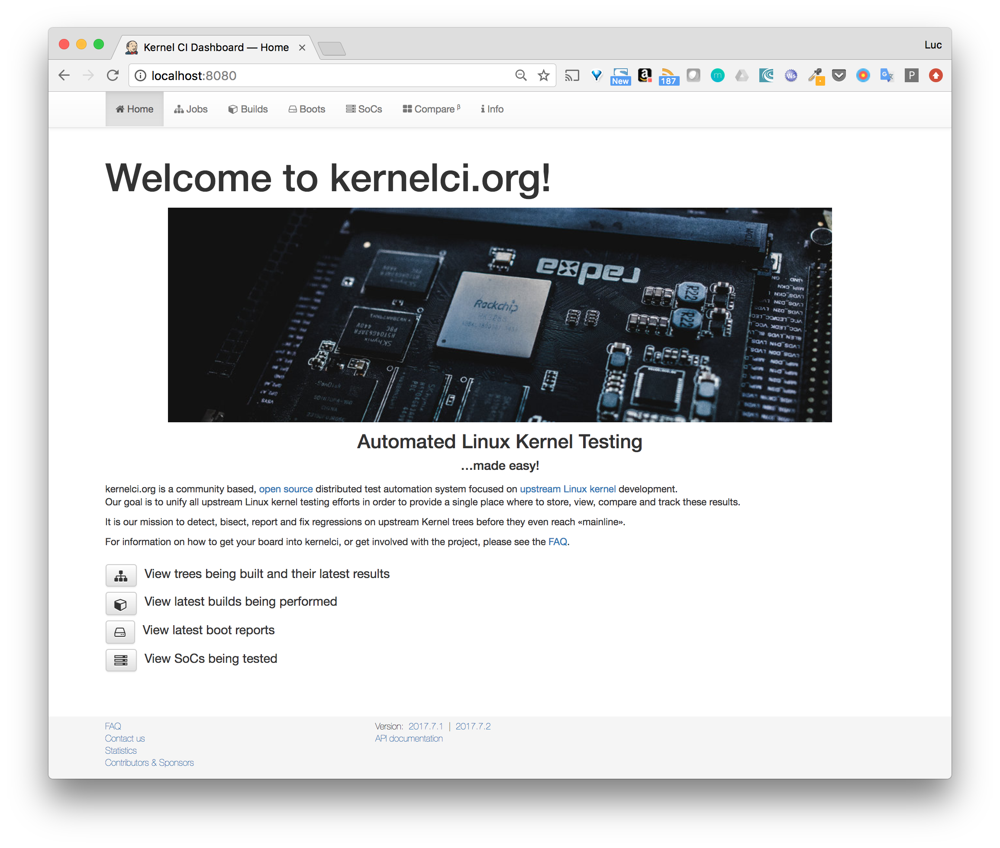

KernelCI Docker
===============

## Purpose

This repository eases the installation process of KernelCI through the usage of Docker containers.

It uses Docker Compose file to decribe the services of the whole application:

* reverse-proxy
* frontend 
* backend
* celery task queue
* redis
* mongo

## Usage

### Setup a Docker host

This can be the local machine, a VM or physical machine with the Docker platform installed.

Docker Machine is a great tool to spin up such hosts locally (on Virtualbox), on a cloud provider (AWS, GCE, Azure, DigitalOcean, ...). In one command line we can easily create a Docker host, the exemples bellow illustrate the usage of Docker Machine to create a Docker host named *kernelci* using different infrastructures.

* Exemple using Virtualbox

```
$ docker-machine create --driver virtualbox kernelci
```

* Exemple using DigitalOcean

```
$ docker-machine create --driver digitalocean --digitalocean-access-token TOKEN kernelci
```

> For DigitalOcean as for any cloud provider, some additional options such as authentication token must be provided when using Docker Machine.

### Activate swarm mode

> Make sure your local Docker client is setup to communicate with the Docker daemon you want to deploy the application on. In case you used Docker Machine to setup the host, you will need to use the command ```eval $(docker-machine env kernelci)```, this will set some environment variables so the client can send Docker related commands to the host created above.

The Docker daemon running the application needs to be in swarm mode, this can easily be configure with the following command:

```
$ docker swarm init
```

In case several IP addresses are found, an additional *--advertise-addr* option needs to be specified indicating the IP to use:

```
$ docker swarm init --advertise-addr IP
```

> A Docker daemon running in swarm mode is requested in order to use some of the latest feature and primitive such as *Config*, *Secret*, ...

### Clone the repository

```
$ git clone https://github.com/lucj/kernelci-docker
$ cd kernelci-docker
```

### Run the application

The startup of the application is done in several steps:
* generation of a UUID
* creation of one config for the frontend and one for the database (mongo) using this UUID
* deploy the application *stack*

All those steps are handled by the *start.sh* script, so the only things you need to do is running

```
./start.sh
```

The web ui is then available on port 8080.



## Upgrade

In the current version, the frontend and backend are built by cloing the code from the following repository:
* [https://github.com/kernelci/kernelci-frontend](https://github.com/kernelci/kernelci-frontend)
* [https://github.com/kernelci/kernelci-backend](https://github.com/kernelci/kernelci-backend)

In order to upgrade the application with the latest version (this only works on the local machine), you need to issue the following command:

```
$ docker-compose build
```

This will create the last versions of the frontend and backend locally.

> Those images would need to be pushed to a repository in order to be deployed on a remote machine

## Status

This is a work in progress [WIP], currently not fully functional.

Several features need to be added:
- to be aligned with the official KernelCI
- to improve and simplify the deployment and architecture of the whole application

Among the ongoing changes:

- [x] Automate the setup (create token from master key, provide token to frontend)
- [ ] Add some tests
- [ ] Check storage part
- [x] Add api documentation
- [x] Add elasticsearch and modify backend so log files are sent to ES
- [ ] Configure reverse proxy (routing with subdomains, TLS termination, ...)
- [ ] Add front and back networks to isolate the services
- [x] Add stack file to deploy the application on a Swarm
- [ ] Usage of env variable or Docker secret to provide the backend token

